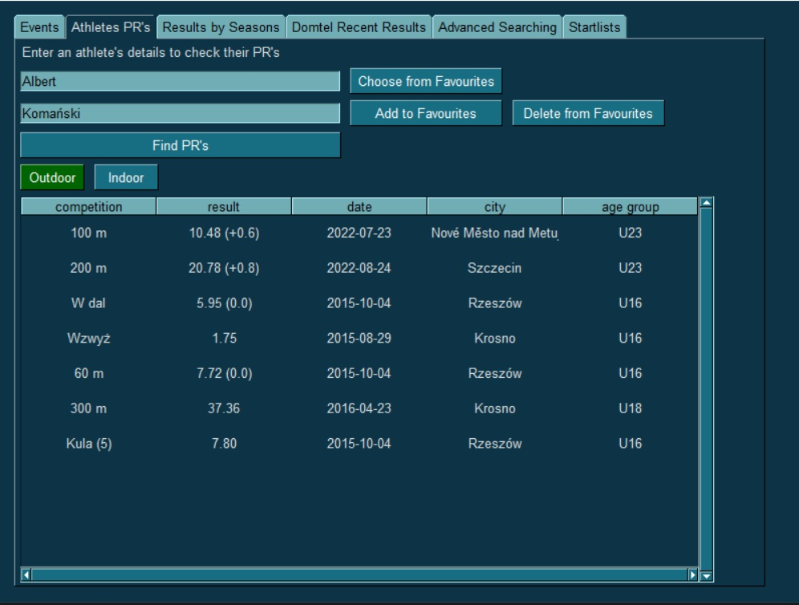

# PZLA_scraper

PZLA_scraper is a sophisticated web scraper equipped with a user-friendly graphical user interface, designed to provide
comprehensive information on Track and Field event results and statistical data on Polish athletes. It is written in
Python and uses BeautifulSoup library for web scraping, requests library for HTTP requests and PySimpleGUI for the
graphical user interface.

The program scrapes data from the following websites:

- [Polski Związek Lekkiej Atletyki](https://www.pzla.pl/)
- [Domtel-sport.pl    ](https://domtel-sport.pl/)

## Installation

If you are familiar with the Python programming language and git technology:

1. Clone the repository: git clone https://github.com/Haudkozaur/PZLA_scraper.git
2. Install the required packages: pip install -r requirements.txt .

If you're a non-programmer and just want to use the app, you can download the PZLA_scraper.zip file from the project's
[GitHub releases page](https://github.com/haudkozaur/PZLA_scraper/releases). Follow these steps to use the app:

1. Download and extract the PZLA_scraper.zip file to a folder of your choice.
2. Double-click the PZLA_scraper.exe file to start the app.

## Usage

- Run the main.py file to start the application.
- Use the graphical user interface to select the desired event and athlete.

### GUI Structure

#### Events tab

The events tab of the PZLA_scraper app displays the ten most recent Track and Field events from the Domtel website.
Users
can easily browse through these events and access detailed information about each event's results.
This feature provides users with a convenient way to stay up-to-date on the latest Track and
Field events.

#### Athletes PR's tab

The athletes PR's tab of the PZLA_scraper app allows users to view the personal bests of Polish athletes in various
Track and
Field events.

#### Results by Seasons tab

The results by Seasons tab of the PZLA_scraper app allows users to view the Track and Field results of Polish athletes
from previous
years.

#### Domtel Recent Results tab

The domtel recent results tab of the PZLA_scraper app allows users to search for athletes by name and view their results
from the
events listed in the first tab. The results for the selected athlete are displayed in an easy-to-read table format. This
feature provides the most recent results from the biggest Track and Field events in Poland because it can even display
live results.

#### Advanced Searching tab

The advanced searching tab of the PZLA_scraper app allows users to choose an athlete and find them in the results of all
track and
field events that have taken place in the current year. This feature provides users with the most trustworthy results,
as some events like cross-country races may not be included in the season results displayed in tab 2. However, this
feature can take a considerable amount of time to run, as the program is sending a large number of requests to the
website to retrieve the results for each event. Nonetheless, this feature provides users with a comprehensive overview
of an athlete's performance across all events in the current year.

#### Startlists tab

The sixth and final tab of the PZLA_scraper app allows users to find a chosen athlete in the start lists of events that
will take place in the upcoming month. This feature provides users with information about where their favorite athlete
will be starting soon. In addition, users can also view a list of all available start lists for events in the upcoming
month. This can be especially useful for fans who want to follow their favorite athletes and stay up-to-date on all the
upcoming Track and Field events in Poland.

#### Favourites

Most of tabs in the PZLA_scraper app includes three buttons that allow users to manage their favorite athletes. The 
'Choose from favorites' button lets users quickly fill in the input text field with the data of a chosen athlete from
their list of favorites. To add an athlete to the list of favorites, the user enters their data into the input text
field and clicks the 'Add to favorites' button. At any time, the user can also remove an athlete from their list of
favorites by clicking the 'Delete from favorites' button.

# License

This project is licensed under the MIT License. See the LICENSE.txt file for details.

### Disclaimer

PZLA_scraper is a web scraper that retrieves publicly available data from the Polski Związek Lekkiej Atletyki website.
We do not own or control the data displayed by the program. We are not responsible for
any inaccuracies, errors, or omissions in the data, or for any damages that may arise from the use or distribution of
the data. Users of the program are solely responsible for their use of the data and should exercise caution when using
it for any purpose.

## Credits

- [BeautifulSoup](https://www.crummy.com/software/BeautifulSoup/bs4/doc/)
- [requests](https://pypi.org/project/requests/)
- [PySimpleGUI](https://www.pysimplegui.org/en/latest/)
- [Pyinstaller](https://www.pyinstaller.org/)

